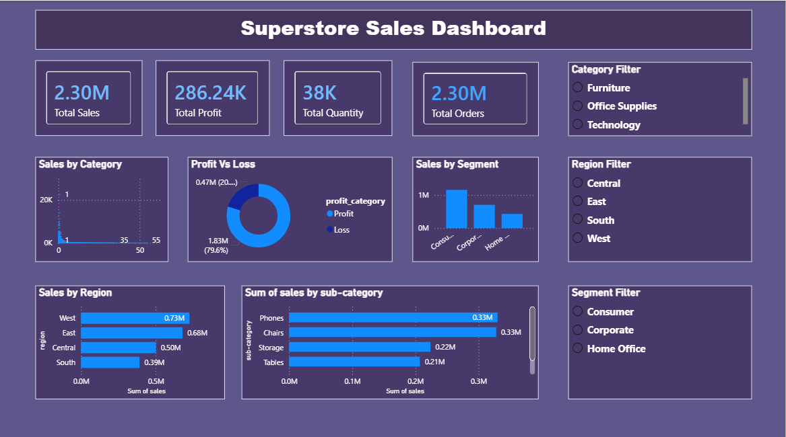
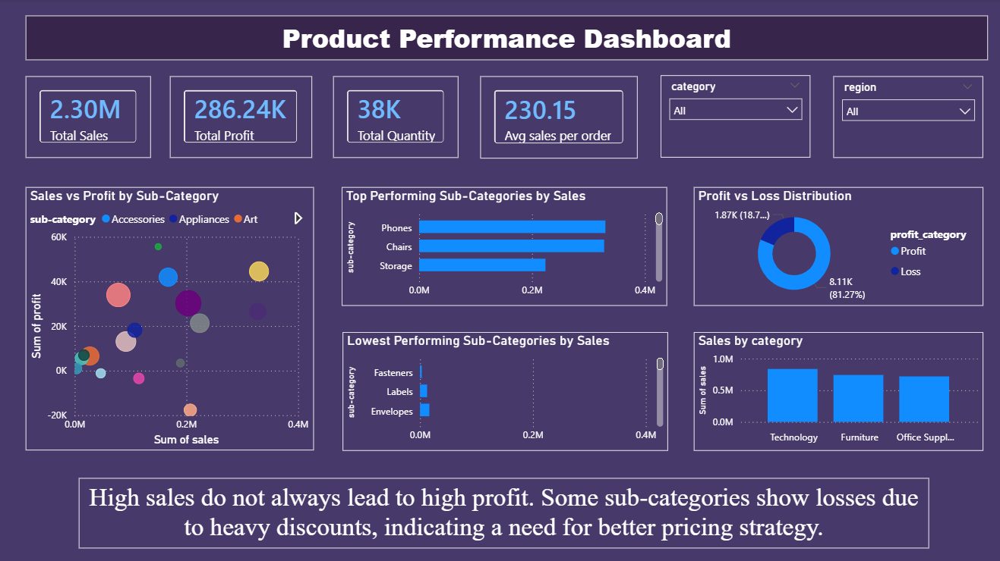

# 📊 ApexPlanet Internship - Data Analysis Project

## 🔍 Project Overview

This project is part of the ApexPlanet Internship and focuses on **data wrangling, exploratory data analysis (EDA), dashboard development, and data storytelling** using Python and Power BI.

The goal is to clean raw data, extract meaningful insights, and build interactive dashboards for business decision-making.

---

## 📁 Dataset

- **Name:** Sample Superstore Dataset

### Dataset Includes:
- Sales
- Profit
- Category
- Region
- Customer Segments
- Discounts
- Product Sub-Categories

---

## ⚙️ Task 1: Data Wrangling (Python)

### ✔ Steps Performed:

- Data loading using pandas
- Data familiarization (`head()`, `info()`, `describe()`)
- Data quality checks (missing values, duplicates)
- Removed duplicate rows
- Feature engineering:
  - `profit_category`
  - `sales_category`
  - `sales_per_order`
- Cleaned column names
- Exported cleaned dataset

---

## 📊 Task 2: Dashboard Development (Power BI)

### ✔ Visualizations Created:

- Sales by Category
- Sales by Region
- Profit vs Loss Distribution
- Sales by Customer Segment
- Key Performance Indicators:
  - Total Sales
  - Total Profit
  - Total Quantity
  - Avg Sales per Order

---

## 📸 Dashboard Preview

---

## 📊 Task 3: Product Deep-Dive Analysis (Power BI)

In this task, I performed a detailed analysis of product performance to identify profitability patterns and business insights.

---

### ✔ Key Visualizations:

- Scatter Plot (Sales vs Profit by Sub-Category)
- Top Performing Sub-Categories
- Lowest Performing Sub-Categories
- Profit vs Loss Distribution
- Sales by Category

---

## 📸 Task 3 Dashboard Preview

---

## 🚀 Key Insights

- Technology category generates the highest sales
- Some orders result in losses despite high sales
- Regional performance varies significantly
- Discounts negatively impact profitability
- Some sub-categories generate losses due to heavy discounts, indicating the need for better pricing and discount strategies

---

## 📑 Task 4: Data Storytelling & Statistical Validation

In this task, I created a business-style presentation to communicate analytical findings and validate business insights using dashboards and statistical reasoning.

### ✔ Included:

- KPI Analysis
- Sales Performance Analysis
- Product Deep-Dive Analysis
- Profit vs Loss Analysis
- Hypothesis Testing
- Business Recommendations

---

### 💡 Key Hypothesis

Higher discounts negatively impact profitability.

---

### 📂 Presentation File

- Located in `presentation/task4_presentation.pptx`

---

## 📖 Data Dictionary

| Column | Description |
|---|---|
| ship_mode | Shipping method |
| segment | Customer segment |
| country | Country |
| city | City |
| state | State |
| postal_code | Postal code |
| region | Region |
| category | Product category |
| sub_category | Product sub-type |
| sales | Revenue |
| quantity | Quantity sold |
| discount | Discount applied |
| profit | Profit earned |
| profit_category | Profit or Loss classification |
| sales_category | High or Low sales |
| sales_per_order | Sales per order |

---

## 🛠️ Tools Used

- Python (Pandas)
- VS Code
- Power BI

---

## 📌 Conclusion

This project demonstrates how raw data can be transformed into meaningful insights using data cleaning, feature engineering, visualization techniques, and storytelling methods.

It also highlights the importance of data-driven decision-making in business analytics.

---